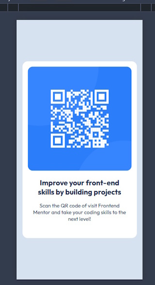

# QR Code

A solution to the Frontend Mentor QR Code component onboarding project.

## Table of contents

- [Overview](#overview)
    - [Screenshot](#screenshot)
    - [Links](#links)
- [My process](#my-process)
    - [Built with](#built-with)
    - [What I learned](#what-i-learned)
    - [Continued development](#continued-development)
- [Author](#author)

## Overview

A basic HTML and CSS only implementation of the Frontend Mentor
[QR code component challenge](https://www.frontendmentor.io/challenges/qr-code-component-iux_sIO_H).
It was a great first test as part of the on-boarding process to Frontend Mentor.

### Screenshot



The mobile view of the component, which has a responsive design to the desktop
as well.

### Links

- Solution URL: [Add solution URL here](https://your-solution-url.com)
- Live Site URL: [Add live site URL here](https://your-live-site-url.com)

## My process

I started with the HTML content before adding any styles, and used the Chrome dev
tools to do start with the mobile layout before testing it in the desktop view.

### Built with

- Semantic HTML5 markup
- CSS custom properties
- Flexbox
- Using a mobile-first workflow
- And testing out the non-commercial version of [WebStorm](https://www.jetbrains.com/webstorm/)

### What I learned

It was great to tryout [WebStorm](https://www.jetbrains.com/webstorm/)
for the first time as I have been using [VSCode](https://code.visualstudio.com/)
for quite some time. Using its built-in test server for previewing and autoloading
changes.

I used minimal, semantic HTML:

```html

<main class="card">
    
    <h2>Improve your front-end skills by building projects</h2>
    <p>
        Scan the QR code of visit Frontend Mentor and take your coding skills
        to the next level!
    </p>
</main>
```

I experimented with a `box-shaddow` for the `card` component and left it in the
`css` as a comment. I would probably use PostCSS to process this out for a production
build. Similarly, I left a stub of a media query in for anything bigger than mobile.

```css
.card {
    margin: 1.1em;
    background-color: var(--colour-white);
    border-radius: 1em;
    max-width: 320px;
    padding: 1em 1em 2em;
    /*box-shadow: 0 0 1em var(--colour-slate-500);*/
    color: var(--colour-slate-900);
}
```

### Continued development

I would definitely suggest revisiting the use of a subtle `box-shaddow` for 
the `card` to make it stand out more. But this was beyond the spec of this 
exercise.

## Author

- Frontend Mentor - [Francis Judge](https://www.frontendmentor.io/profile/FJSolutions)
